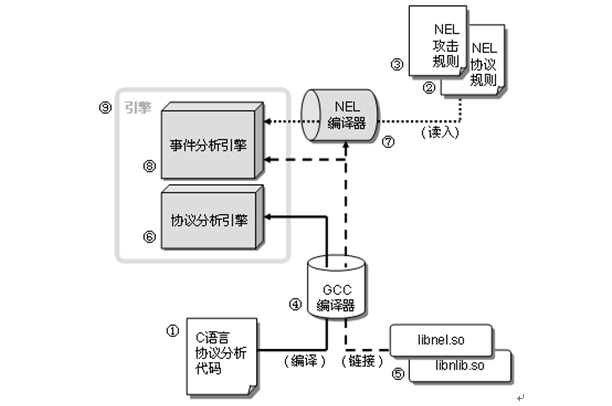
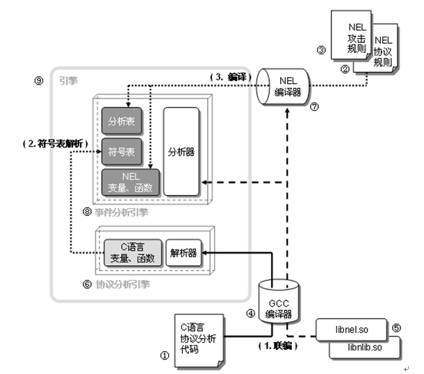
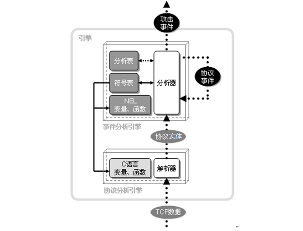

#  使用NEL开发应用协议安全引擎

使用[NEL](https://github.com/siegfried415/libnel)可以快速开发出针对某个协议的"协议分析引擎"和"事件分析引擎"，前者使用传统编译器（如GCC）编译而成；后者使用NEL编译器生成。和GCC这种独立编译器不同，NEL编译器是一个内置的编译器，它能够在运行期读入\*.nel文件进行语法分析，在内存中生成事件分析引擎，并最终构成一个引擎实体。在这里C语言是宿主语言，而NEL是寄生语言。

在[文件结构](#文件结构) 中，我们将对参与引擎制作的各个文件实体加以介绍；在[事件分析引擎的生成](#事件分析引擎的生成)中，将对引擎的预处理工作加以介绍，当预处理结束后，"事件分析引擎"就被创建了；在第[执行过程](#执行过程) 中，我们将介绍在运行期，引擎是如何处理输入的数据包的。

## 文件结构

一个完整的引擎需要开发人员提供三部分代码：协议开发人员使用C语言编写的应用层协议分析代码①，协议开发人员用NEL编写的协议规则②，以及攻击开发人员用NEL编写的攻击规则③（如图1）。

图1 引擎的文件结构

### 协议分析代码

在C语言协议分析代码①中，协议开发者要完成三项基本工作：

1.  使用C语言来定义"协议实体"结构体，所谓"协议实体"是指协议的信息单元，比如对于smtp的EHLO命令，我们定义一个smtp_cmd_ehlo结构体：
<pre>
struct smtp_cmd_ehlo {
    NEL_REF_DEF //NEL使用的引用计数
    char *host_name; //主机名
    short host_name_len; //主机名长度
};
</pre>

一但在C语言中定义了"协议实体"结构体，攻击规则开发人员就可以使用引用这些结构体编写NEL规则。注意，为了能够让NEL事件分析引擎可以自动地处理协议实体变量的释放，我们在该C语言结构体中增加了一个引用计数，这是使用"analysis.h"提供的NEL_REF_DEF宏来实现的，一个结构体如果缺少这个引用计数定义，则nel编译器会给出错误信息并停止处理。

2.  当向事件分析引擎提交一个协议实体变量的时候，需要协议开发人员指定该协议实体所对应的事件在NEL名字空间中所对应的事件标识号，比如我们使用int ehlo_id来保存smtp_cmd_ehlo这个协议实体类型所对应的事件标识号，我们可以在C语言中使用
nel_func_name_call来设定ehlo_id的值，比如：
<pre>
nel_func_name_call(eng， (char *) &ehlo_id， "idof"，"ehlo_req");
</pre>

或者在NEL文件中，使用idof来对C语言空间中定义的ehlo_id来进行设定：
<pre><em>
main{
    ehlo_id = idof ( "ehlo_req");
}
</em></pre>

3.  编写协议分析过程中所需的分析函数，比如smtp_ehlo_parse。这些分析函数的任务是从数据包中分析出协议的关键字、参数等信息，并将这些信息封装到"协议实体"变量中，这些函数由"协议分析引擎"⑥自行调用。

4.  编写攻击检测所需要的一些C语言检测函数，比如对某些复杂的协议约束关系进行检验的函数。尽管这些函数使用C语言来编写，但是它们不是由C语言中的函数直接地调用，而是由"事件分析引擎"⑧调用。

C语言的编写工作结束后，我们就可以将此代码同libnel.so和libnlib.so⑤进行链接，以生成可执行的二进制文件。此后，协议规则开发者和攻击规则开发者就可以分别使用NEL编写协议规则②和攻击规则③。

### 协议规则和攻击规则

协议规则的作用是为攻击规则提供一个预定义的"事件"的编程接口，攻击规则的开发者将使用这些事件来编写攻击规则。"事件"是"事件分析引擎"的基本处理的单元，对于"协议分析引擎"中的每一个"协议实体"都有一个与之对应的"事件"，协议规则开发人员通过定义"事件"和事件之间的"规则"来定制"事件分析引擎"。

在NEL中，"事件"的定义是使用*atom*和*event*关键字来完成的，"协议分析引擎"直接给出的"协议实体"对应"原子事件"，用*atom*来定义，而在"事件分析引擎"中派生的各种事件都是抽象事件，使用*event*来进行定义：

<pre><em>
atom struct smtp_cmd_ehlo *ehlo_req;
event struct smtp_cmd_ehlo *EHLO_REQ_OK， *BAD_EHLO_REQ;

</em></pre>

此后，协议开发人员将需要定义一个链式推理规则，该推理链规定了如何根据"原子事件"一步一步地实现 *_target*这个终极目标的过程：
<pre><em>
EHLO_REQ_OK : ehlo_req ! BAD_EHLO_REQ ;
COMD        : EHLO_REQ_OK ;
COMDS       : COMD | COMDS COMD ;
SMTP_CON    : COMDS ;
_target	    : SMTP_CON ;

</em></pre>

此后，攻击规则开发者就可以根据自己对于攻击特征的了解，使用上述事件编程接口编写攻击规则。比如定义某个事件内部的约束关系，或者定义多个事件之间的约束关系。在此过程中，规则开发者可以使用C语言中的各种语言实体（包括结构、联合、枚举、变量、函数，但不包括宏、表达式和语句），比如：
<pre><em>
BAD_LONG_EHLO：ehlo_req( $1->host_name_len >= 512 )
{
    print("found a long ehlo command! len =%d\n"，$1->len);
    smtp_deny($0);
}
;
</em></pre>
这条规则规定在接收到一个*ehlo_req*请求事件时，如果该请求事件的请求数据长度（host_name_len）大于512字节时，就产生了一个*BAD_LONG_EHLO*事件，然后通过smtp_deny函数关闭掉这条SMTP连接。

然后通过如下规则，将*LONG_EHLO*定义为是*BAD_EHLO_REQ*的一种，从而将攻击规则加入到"事件分析引擎"的推理链中：
<pre><em>
BAD_EHLO_REQ: LONG_EHLO ;
	
</em></pre>

##  事件分析引擎的生成

在得到一个用C语言编写的应用协议源代码①、一个协议NEL文件②和若干个攻击NEL文件③后，引擎还尚未建立，我们首先需要使用GCC编译器④编译协议分析代码（使用gstabs+选项），并同libnel.so、libnlib.so⑤联编到一起，这样我们就得到了一个二进制可执行文件。该二进制文件执行后，将在内存中建立"协议分析引擎"⑥以及一个内嵌的NEL编译器⑦，⑥将调用⑦中提供的函数进行以下工作：

1.  在内存中创建"事件分析引擎"⑧；

2.  进行符号表初始化；

3.  读入②和③来构造完整的⑧。

这样在内存中形成的⑥和⑧构成了"引擎"⑨（如图1-2）。

步骤1是通过调用libnel的nel_eng_alloc函数来完成的。nel_eng_alloc函数的作用是分配一个nel_eng结构，它包含了事件分析引擎⑧的各个阶段（符号表解析，分析表生成，优化和编译）所使用到的全部数据结构。
<pre>
struct nel_eng *eng;
if(!(eng = nel_eng_alloc())){
    DEBUG_SMTP(SMTP_DBG，"Network Engine malloc failed !\n");
    goto shutdown;
}
</pre>

步骤2是协议分析引擎调用libnel中的stab_file_parse函数，将协议分析引擎中的各种C语言实体（枚举型常量、全局变量、全局函数等）读入到符号表中。利用该符号表，NEL就可以调用在C语言中定义的枚举常量、全局变量和全局非静态函数。
<pre>
if (stab_file_parse(eng，argv[0]) < 0){
    DEBUG_SMTP(SMTP_DBG，"Network Event Engine stab failed!\n");
    goto shutdown;
}
</pre>

步骤3是协议分析引擎读入协议NEL文件和攻击NEL规则文件，并调用libnel.so中的nel_file_parse对NEL文件进行词法分析和语法分析，最终形成"符号表"和用于状态匹配的"分析表"。
<pre>
if (nel_file_parse(eng，rule_file ) != 0 ){
    printf("Network Event Engine init failed!\n");
    goto shutdown;
}
</pre>

到此为止"事件分析引擎"最终在内存中被建立起来了。

上述"事件分析引擎"的生成过程如图2所示，⑥为"协议分析引擎"，⑧为"事件分析引擎"。⑧中的"分析器"和"NEL编译器"⑦ 是libnel.so中的固定代码实现的；⑧中除"分析器"外的其它部分，则是"NEL编译器"⑦通过读取NEL规则脚本②和③在内存中生成的。

图2 事件分析引擎的生成过程

##  执行过程

通常，为了维护应用级会话需要保存应用级连接状态。与此类似，为了维护事件分析的状态，我们要保留"事件分析状态"信息，struct nel_env就是用来保存事件分析状态的数据结构。

一般地说，协议分析引擎建立会话节点时要建立相应的nel_env，nel_env是通过调用nel_env_init来初始化的。
<pre>
void init_smtp_info (struct smtp_info *psmtp)
{
    ......
    nel_env_init(eng，&(psmtp->env)，info_id，psmtp);
}
</pre>

当事件分析引擎建立起来后，协议分析引擎对输入的TCP报文进行基本的协议分析，并将分析出来的协议信息按照一定粒度（例如以一个命令或应答为单位）封装成"协议实体"变量。
<pre>
ehlo = smtp_cmd_ehlo_new(length, host_name);
if ( ehlo == NULL) {
    res = SMTP_ERROR_MEMORY;
    goto free;
}
</pre>

然后协议分析引擎调用在libnel中封装的nel_env_analysis将"协议实体"变量交给事件分析引擎的"分析器"来进行深入的检查。
<pre>
if (( r = nel_env_analysis(eng，&(psmtp->env)，ehlo_id，(struct smtp_simple_event *)ehlo) ) < 0 ) {
    res = SMTP_ERROR_ENGINE;
    goto free;
}
</pre>

在事件分析引擎中，每个"协议实体"都将被转换为"事件"来处理。分析器根据"事件分析状态"和"分析表"调用NEL函数或者C语言中定义的函数来判断"事件"的类型（如判断是*EHLO_REQ_OK*协议事件，还是*BAD_LONG_EHLO*攻击事件）。如果只是"协议事件"，"分析器"将返回，"协议分析引擎"继续下一个TCP报文的处理；如果"分析器"发现"攻击事件"，将触发相应的响应动作（阻断、报警或者忽视）。"事件"的分析过程如图3：

图3 引擎的执行过程

当释放连接的时候，将调用libnel中的nel_env_cleanup来释放nel_env结构体：
<pre>
void free_smtp_info (struct smtp_info *psmtp)
{
    ......
    nel_env_cleanup(eng，&(psmtp->env));
}
</pre>

最后，在程序退出之前，需要使用nel_eng_dealloc释放nel_eng:
<pre>
    nel_eng_dealloc(&eng);
</pre>
