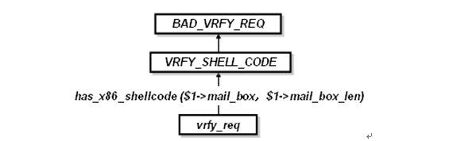
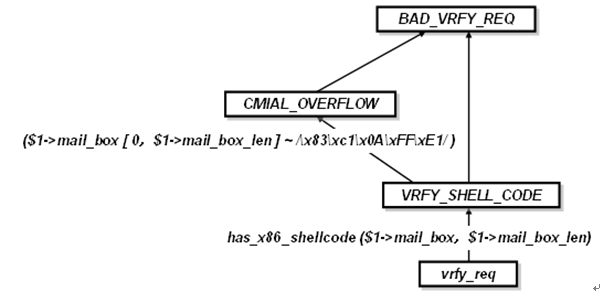

# 使用NEL创建攻击检测规则

## 简介
应用协议安全开发人员可以使用[NEL](https://github.com/siegfried415/libnel)来快速构造一个应用协议安全引擎，关于具体如何使用NEL开发应用协议安全引擎，请参考[NEL用户手册](https://github.com/siegfried415/libnel/blob/main/doc/nel-user-guide.md)和[使用NEL生成应用协议安全引擎](how-to-write-application-engine-with-nel.md)，本文将着重介绍如何使用NEL创建不同种类的攻击检测规则。

根据攻击种类的不同，NEL可以用来定义[协议限制规则](#协议限制规则)、[漏洞规则](#漏洞规则)和[攻击规则](#攻击规则)。除此之外，NEL还可以用来定义状态规则，我们将在[状态规则](#状态规则) 中讨论状态规则的多种实现方式。

此外，由于NEL语言可以灵活地使用C语言中定义的语言实体，使得我们可以根据不同的需求，灵活地选择在C还是在NEL语言中来实现同样的规则，在本文的最后对此加以讨论。

## 按照攻击分类的规则

根据攻击检测的不同机制，我们可以定义三种类型的攻击检测规则：协议限制规则、漏洞规则和攻击规则，这三类规则的叠加既可以提高检测的准确性，又能够有效地降低开发成本。

### 协议限制规则

协议限制规则负责协议异常的识别。经过我们的调查，有相当比例的攻击可以通过协议限制规则就能够发现，比如对于攻击CAN-1999-0098,CAN-1999-0284, CAN-1999-1529, CVE-2000-0042, CVE-2000-0488,CVE-2000-0507, CAN-2000-0657, CAN-2003-0264,
CAN-2004-1291，都可以通过限制EHLO请求头的长度而被阻断，相应的协议限制规则ehlo_long.nel定义如下：

<pre><em>
BAD_LONG_EHLO: ehlo_req( $1-> host_name_len >= 512 ) {
    print("found a long ehlo command! len =%d\n", $1->len );
    smtp_deny($0);
}
;
</em></pre>

这是一条非常简单的规则，它只是规定在接收到一个EHLO请求事件时，如果该请求事件的请求数据长度（host_name_len）大于512字节时，就关闭掉这条SMTP连接。

我们再看另外一个例子，根据RFC 2821，我们知道在一个正常的SMTP连接过程中，客户端发送过一个RCPT TO请求命令之后，客户端才会发送DATA请求命令。Cisco PIX Firewall可以做SMTP应用层的内容过滤，用户可以配置PIX，使得PIX只允许某些SMTP命令通过，而象EXPN、VRFY等危及安全的命令则丢弃掉。但是它允许位于DATA和
\<CR\>\<LF\>\<CR\>\<LF\>.\<CR\>\<LF\>之间的所有数据通过，这些数据通常作为邮件正文内容出现，位于这些数据中的EXPN之类的关键字并不过滤抛弃掉。

但是如果攻击者在RCPT TO命令之前发送DATA命令，则SMTP SERVER将返回503错误，指出需要先发送RCPT TO命令。然而，PIX防火墙意识不到这种欺诈行为，它始终允许这之后的数据通过，直到收到\<CR\>\<LF\>\<CR\>\<LF\>.\<CR\>\<LF\>。攻击者可以利用这个漏洞做很多事情。
<pre>
helo ciao
mail from: pinco@pallino.it
data ( From here pix disable fixup)
expn guest ( Now i could enumerate user vrfy oracle and have access to all command)
help
whatever command i want
quit
</pre>

可以通过下面的基于协议限制的NEL规则来阻挡住所有那些违反这一点的DATA请求命令：
<pre><em>
BAD_DATA_REQ: data_req($0->mail_state < SMTP_MAIL_STATE_RCPT ) {
    print("Haven 't seen RCPT TO command before this DATA command!\n");
    smtp_deny($0);
}
;
</em></pre>

这样，即便我们在书写协议限制规则时对具体的攻击（Cisco PIX Firewall Bypass）一无所知，我们也能根据RFC规定的协议规范写出NEL规则从而阻挡住相当一部分的攻击，这使得应用安全程序具有一定程度的0-Day保护功能。

### 漏洞规则

对于某类攻击，如果我们能够分析出这类攻击的本质特征（即攻击者为了利用某些漏洞不可避免地要使用的攻击手段），那么我们就可以忽略掉这些具体攻击中的特定成分，而以漏洞的本质特征来定义规则，这样定义的规则就叫做漏洞规则。

举例来说，我们发现几乎所有的针对缓冲区溢出的攻击，都是由两部分代码构成的：一部分是利用程序的脆弱性使得程序偏离正常流程的引导代码，另一部分是在引导代码得手后具体进行的攻击实现代码（打开端口、启动一个shell,植入一个木马等）。

为了检测出前者，我们必须研究每个具体攻击的引导部分，然而由于我们几乎不可能知道被攻击的机器的内存分布情况，因此确切的检测是不可能的。但是对于后者，由于攻击者往往使用相对固定的几种方式来进行，我们就比较容易地根据攻击代码来做出准确的检测。

根据这种思路，我们实现了一个shellcode的检测函数，该函数使用高效的解码算法来判断输入是否是一段具有某种特征的连续机器码。该实现和具体的漏洞、协议实现无关，甚至可以跟OS无关，而只和被攻击的机器的体系结构有关，实验证明这个函数具有比较高的准确率和效率。

利用shellcode检测函数对SMTP中的VRFY请求进行缓冲区溢出检测的NEL规则如下：
<pre><em>
event struct smtp_cmd_vrfy *VRFY_SHELL_CODE;
VRFY_SHELL_CODE: vrfy_req( has_x86_shellcode($1->mail_box, $1->mail_box_len)) {*
    print("found machine instructions in ehlo command, this maybe a shell code!\n");
    return $1;
}
;

BAD_VRFY_REQ: VRFY_SHELL_CODE {
}
;
</em></pre>

上面的规则可以理解为：当事件分析引擎读入了一个*vrfy_req*事件，测试一下它是否满足has_x86_shellcode(\$1-\>mail_box，\$1-\>mail_box_len)，如果满足，根据该规则，我们得到了一个*VRFY_SHELL_CODE*事件，继而得到一个*BAD_VRFY_REQ*事件，并打印相应的报警信息。

同协议限制规则一样，漏洞规则也具备一定的抽象性，它可以使得开发者能够以比较少的开发代价来实现对于不确定多数的攻击的检测，使得安全程序具有一定程度的0-Day保护功能。

###  攻击规则

根据攻击的某个具体的特征定义的检测规则，这种规则又叫签名（signature），攻击规则未必能够表现漏洞的本质，因而可能存在误报问题。

另外，如果我们已经有一个事先存在的漏洞规则，那么我们对某一特定攻击有了深入的了解，以致于能够精确地确定它的特征的情况下，我们就可以使用二层规则的方式来定义攻击规则，亦即将攻击规则定义到漏洞规则之上，下面我们以C-Mail SMTP Server Remote Buffer Overflow 攻击为例来说明这点：

<pre><em>

event struct smtp_cmd_vrfy *VRFY_SHELL_CODE;*
event struct smtp_atk *CMAIL_OVERFLOW;*

CMAIL_OVERFLOW : VRFY_SHELL_CODE ($1->mail_box[0，$1->mail_box_len] ~ /\x83\xc1\x0A\xFF\xE1/ ){
    print("Found a C-Mail SMTP Server Remote Buffer Overflow Exploit!\n");
    smtp_deny($0）;
}
;

BAD_VRFY_REQ : CMAIL_OVERFLOW {
    ......
}
;

</em></pre>

请注意在上面的定义中，攻击事件*CMAIL_OVERFLOW*不是定义在协议分析引擎直接传递过来的*vrfy_req*原子事件之上，而是定义到*VRFY_SHELL_CODE*这个事件之上。也就是说，在前述*VRFY_SHELL_CODE*这个事件产生之后，如果*VRFY_SHELL_CODE*这个事件之上的事件还能满足(\$1-\>mail_box\[0，\$1-\>mail_box_len\]\~/\\x83\\xc1\\x0A\\xFF\\xE1/)，那么它将形成一个*CMAIL_OVERFLOW*事件，并将连接阻断。

这样，开发人员一开始可以根据某类攻击的抽象特征，制定一些抽象的检测规则，此后随着对攻击的深入了解，他可以在前者的基础之上建立起更加精确的检测规则。NEL语言的这种可扩充性使得开发人员在扩充规则的过程中，仍旧能够保持比较好的检测效率和描述能力。

### 状态规则

有一些恶意行为，我们无法通过单包、或者单事件来检测到，而必须综合考虑多个包、事件之间的关系，才能进行准确的检测，我们称这样的规则叫为"状态规则"。在NEL中可以使用变量或者多事件规则来书写状态规则，另外，我们还要介绍一种基于字符流的检测方法，这其实是一种隐含的状态规则。

### 使用变量来保存状态

当SMTP服务器对客户的EHLO请求应答时，将服务器所能接收的命令保存到\$0-\>cmd_allow中，那么当后续的MAIL FROM请求到达时，我们可根据保存在连接节点中的cmd_allow来判断MAIL FROM之后所携带的关键字是否合法。

例如：
<pre><em>
BAD_MAIL_REQ: mail_req( $1->key == SMTP_MAIL_SIZE && $0->cmd_allow[SMTP_ALLOW_SIZE] == 0 ) { 
        print("found a MAIL FROM command with keyword SIZE without declaration of SIZE at previous EHLO ACK!\n");
        smtp_deny($0 );
}
;
</em></pre>

在NEL中，我们不仅可以像C语言一样地使用数组脚标，还能够无缝地使用在C语言中定义的枚举（enum）常量，这给我们书写NEL规则带来了极大的便利。

### 使用多事件来保持状态

根据前面的介绍，Cisco PIX Firewall Bypass攻击的问题就出在，在发送rcpt to命令之前就发送了data命令，我们可以定义多事件规则来检测它：
<pre><em>
BAD_COMDS: data_req($0->mail_state == SMTP_MAIL_STATE_ORIGN ) ack($2->code == 503) {
        print("There maybe a Cisco PIX Firewall SMTP Content Filting Evasion Attack!\n");
        smtp_deny($0 );
}
;
</em></pre>

### 字符流过滤

比如邮件正文部分的分析过程中，协议分析引擎将邮件正文中的信件内容作为*text*事件提交上来。其中，*text*事件的类型为smtp_mime_text，*text*事件中的事件变量未经过解码，不能在*text*事件的基础上进行字符流的过滤。为了解决这个问题，我们可以定义一个*TEXT*事件，其类型是smtp_mime_text_stream，并调用smtp_mime_body_parse对*text*事件的raw data进行解码，然后将解码后的数据加入到smtp_mime_text_stream中去：

<pre><em>
atom	struct smtp_mime_text	*text;
event 	struct smtp_mime_text_stream	*TEXT；

TEXT	: text 
	{
		print("--->TEXT: text\n");
		struct smtp_mime_text_stream *s;
		s = smtp_mime_text_stream_new($1->encoding, $1->encoded );
		smtp_mime_body_parse ($1->data, $1->length, $1->encoding, s);
		return s;
	}

	| TEXT text 
	{
		print("--->TEXT: TEXT text\n");
		smtp_mime_body_parse ($2->data, $2->length,  $2->encoding, $1);
		return $1;

	}
	;

</em></pre>

由于*TEXT*事件变量中包含的是解码后的数据流，这样我们就可以对*TEXT*中的ts_stream字段使用流匹配算符"\~"进行字符流过滤，其中，中间匹配状态的保留都是由系统自动执行的，我们独特的字符流匹配技术使得模式"fsdf" 即使跨越两个*text* 也能被检测出来，而不会出现检测逃避漏洞。
<pre><em>
event struct smtp_atk	*TEXT_MATCH; 
TEXT_MATCH: TEXT( $1->ts_stream ~/fsdf/ )
	{
		print("found forbiden string in TEXT!\n");
		smtp_deny( $0 ); 
	}
	;

</em></pre>

## 在何处实现检测函数
在NEL规则中，即可以使用NEL中定义的函数，也可以使用在C语言中定义的函数，从而大大提高规则的可定制性，下面我们以字符串匹配为例来说明这个问题。

### 使用NEL内置函数的规则

使用NEL的字符串匹配函数是实现字符串匹配的最简单的方式，例如为了在NEL中实现对EHLO命令的检测，我们增加一个ehlo_nel_match.nel：
<pre><em>
EHLO_BAD_STRING: ehlo_req($1->host_name[0, $1->host_name_len] ~ /foo/ ))  {
    print("found \"foo\" in ehlo command, this maybe a attack!\n");
    smtp_deny($0);
}
;
</em></pre>

### 使用C语言函数的规则

在某些复杂的情况下，我们可能需要将数据定义在NEL空间，并在NEL中调用C语言中预定义的检测函数（只要该检测函数在C语言中已经定义过）。比如，对于EHLO命令，攻击规则的开发人员就可以在NEL中定义这样的一个数组：
<pre><em>
static char *ehlo_black_list[] = {
    "foo",
    "bar",
    "bla\"
};

static struct match_info *ehlo_black_list_tree;
</em></pre>

然后调用C语言中的buf_match_init初始化函数，来对此数组进行初始化
<pre><em>
init{
    ehlo_black_list_tree = buf_match_init(ehlo_black_list, 3 );
}
</em></pre>

然后在*ehlo_req*事件发生时，我们可以使用C语言中定义的buf_match函数来定义用户自定义规则：
<pre><em>
EHLO_BAD_STRING: ehlo_req(buf_match($1->host_name, $1->host_name_len, ehlo_black_list_tree)) {
    print("found supectious strings in ehlo command, this maybe a attack!\n");
    smtp_deny($0);
}
;
</em></pre>

这种方式使得系统可以兼具灵活性和高效。

### 完全在NEL层面实现的规则

当然，我们也可以完全使用NEL来完成上述的工作，这种方式具有最高的灵活性,但是这种做法一般来说可能不是高效的。比如，上面的black_list如果全在NEL中实现的话，将会是：
<pre><em>
static int ehlo_black_list_num ;
static char *ehlo_black_list[] = {
    "foo",
    "bar",
    "bla\"
};

init {
    int i;
    ehlo_black_list_num = sizeof(ehlo_black_list) / sizeof(char *);
    for(i = 0; i < ehlo_black_list_num; i++) {
        print("ehlo_black_list[%d] = %s\n\", i, ehlo_black_list[i]);
    }
}
</em></pre>

用户在nel中自行定义my_ehlo_black_list_match为（返回值大于0为真，否则为假 )：
<pre><em>
int my_ehlo_black_list_match(char *data, int len) {
    int i;
    for(i = 0; i < ehlo_black_list_num; i++) {
        if(nel_strstr(data, ehlo_black_list[i]) != 0) {
            print("nel_strstr matched!\n");
            return 1;
        }
    }
    return 0;
}
</em></pre>

然后在*ehlo_req*事件发生时，我们可以调用my_ehlo_black_list_match来进行检测：
<pre><em>
EHLO_BAD_STRING: ehlo_req(my_ehlo_black_list_match($1->host_name, $1->host_name_len)) {
    print("found supectious strings in ehlo command, this maybe a attack!\n");
    smtp_deny($0);
}
;
</em></pre>

这样，通过提供协议限制规则、漏洞规则、攻击规则、行为规则、和用户自定义等多种规则实现技术，基于NEL的安全系统可以阻隔各种层次的攻击，这五类规则的叠加既可以提高检测的准确性，又能够有效地降低开发代价。
